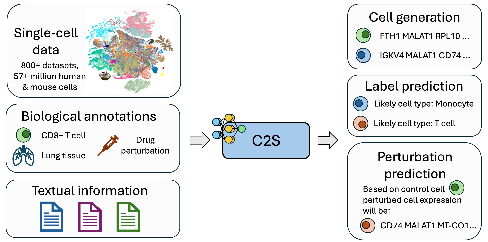

# Cell2sentence: Single-cell Analysis With LLMs

[](https://creativecommons.org/licenses/by-nc-nd/4.0/)
[](https://badge.fury.io/py/cell2sentence)
[](https://doi.org/10.1101/2023.09.11.557287)
[](https://www.python.org/downloads/release/python-380/)



Implementation of ["Cell2Sentence: Teaching Large Language Models the Language of Biology"](https://www.biorxiv.org/content/10.1101/2023.09.11.557287v3.full.pdf).
Cell2Sentence (C2S) is a framework for directly adapting Large Language Models (LLMs) to single-cell biology. C2S proposes a rank-ordering transformation of cell 
expression into cell sentences, which are sentences of space-separated gene names ordered by descending expression. By representing single-cell data as cell 
sentences, C2S provides a framework for LLMs to directly model single-cell biology in natural language, enabling diverse capabilities on multiple single-cell
tasks.

For more information, please refer to the manuscript, or feel free to reach out to us at [van Dijk Lab](https://www.vandijklab.org/)!


## News

🎉 (09/03/2024) We release the new C2S code base, with core functionalities for working with C2S models in common single-cell workflows!

🎉 (09/03/2024) We release a new suite of Pythia models for cell type prediction, cell type conditioned generation, and a diverse multi-cell multi-task model! These models are trained on over 57 million human and mouse cells from CellxGene and Human Cell Atlas.

🎉 (05/01/2024) Cell2Sentence was accepted to ICML 2024! Congratulations to all of the authors involved in the project. See you in Vienna!

🎉 (02/15/2024) **pythia-160m-c2s** trained on full cell sentences is available on the Hugging Face hub [here](https://huggingface.co/vandijklab/pythia-160m-c2s)! This new model generates and predicts cell types from entire cells directly in text with the [Pythia-160 base model](https://huggingface.co/EleutherAI/pythia-160m).

🎉 (02/15/2024) Our **updated preprint** was posted on BioRxiv [here](https://www.biorxiv.org/content/10.1101/2023.09.11.557287v3). We introduce our latest results, including full cell sentence generation, combinatorial cell label prediction, abstract generation, and training on a large multi-tissue dataset of 36M cells.


## Installation

To set up a cell2sentence environment, first pull the repository locally:
```bash
git clone https://github.com/vandijklab/cell2sentence.git
```

Navigate a terminal into the root of the repository. Next, create an Anaconda environment using `python3` using [anaconda](https://docs.anaconda.com/anaconda/install/) with:
```bash
conda create -n cell2sentence python=3.8
```

Next, activate the environment:
```bash
conda activate cell2sentence
```

Finally, run the setup:
```bash
make install
```

This will install the latest development environment of cell2sentence, along with other pacakge dependendies. You can also install cell2sentence itself using `pip`:
```bash
pip install cell2sentence
```

The C2S package will allow usage of the core functionalities of C2S, including inference using existing C2S models and finetuning your own C2S models on your own datasets.

If you would like to speed up inference, you can optionally install flash-attention, which speeds up inference times particularly for long sequences (e.g. for generating cells with more than a few hundred genes):
```bash
pip install flash-attn --no-build-isolation
```
Detailed instructions for installing flash-attention can be found in the official [installation instructions](https://github.com/Dao-AILab/flash-attention?tab=readme-ov-file#installation-and-features). To enable flash attention 2, see the example in tutorial notebook 5 (cell generation).

## Tutorials

The following notebooks provide guides on common workflows with C2S models.

| Notebook | Description                                             |
----------|---------------------------------------------------------|
| [c2s_tutorial_0_data_preparation.ipynb](tutorials/c2s_tutorial_0_data_preparation.ipynb) | Data loading and preprocessing example on an immune tissue dataset
| [c2s_tutorial_1_rank_transformation_and_reconstruction.ipynb](tutorials/c2s_tutorial_1_rank_transformation_and_reconstruction.ipynb) | C2S rank transformation to cell sentences and inverse transformation
| [c2s_tutorial_2_cell_embedding.ipynb](tutorials/c2s_tutorial_2_cell_embedding.ipynb) | Obtaining cell type embeddings with C2S models
| [c2s_tutorial_3_finetuning_on_new_datasets.ipynb](tutorials/c2s_tutorial_3_finetuning_on_new_datasets.ipynb) | Finetuning C2S models on new datasets
| [c2s_tutorial_4_cell_type_prediction.ipynb](tutorials/c2s_tutorial_4_cell_type_prediction.ipynb) | Cell type prediction using C2S models
| [c2s_tutorial_5_cell_type_generation.ipynb](tutorials/c2s_tutorial_5_cell_type_generation.ipynb) | Cell generation conditioned on cell type
| [c2s_tutorial_6_cell_annotation_with_foundation_model.ipynb](tutorials/c2s_tutorial_6_cell_annotation_with_foundation_model.ipynb) | Cell type annotation with foundation model


## Model Zoo

The following is a collection of C2S pretrained models which are released for open use. Each is available through Huggingface, and has different capabilities
and pretraining recipies. More details on each model are provided in their respective Huggingface cards, and tutorial notebooks for different C2S workflows
each explain which model they use.

| Model name | Task(s)                   | Training Data                         |
----------|---------------------------------------------------------|------|
| [C2S-Pythia-410M cell type prediction model](https://huggingface.co/vandijklab/C2S-Pythia-410m-cell-type-prediction) | Next gene prediction, cell type prediction | CellxGene, HCA, cell type annotations
| [C2S-Pythia-410M cell type conditioned single cell generation model](https://huggingface.co/vandijklab/C2S-Pythia-410m-cell-type-conditioned-cell-generation) | Next gene prediction, cell type conditioned single-cell generation | CellxGene, HCA, cell type annotations
| [C2S-Pythia-410M diverse single- and multi-cell tasks model](https://huggingface.co/vandijklab/C2S-Pythia-410m-diverse-single-and-multi-cell-tasks) | Next gene prediction, diverse single- and multi-cell prediction and generation tasks | CellxGene, HCA, cell type and tissue annotations, paper abstracts
| [C2S-Pythia-160M full cell generation (legacy)](https://huggingface.co/vandijklab/pythia-160m-c2s) | Next gene prediction, cell type prediction | Immune tissue ([Domínguez Conde et al.](https://www.science.org/doi/full/10.1126/science.abl5197)), cell type annotations
| GPT-2 Large foundation model (legacy) | Next gene prediction, cell type prediction, conditional single-cell generation | CellxGene, HCA, cell type and tissue annotations, paper abstracts


## Feature Development
- [x] Add core functionality for cell sentence conversion, data manipulation
- [x] Add CSModel wrapper, finetuning functionality
- [x] Add prompt formatting, support for multiple tasks
- [x] Add functionality for inverse reconstruction back to expression vectors
- [x] Add tutorial notebooks for main C2S workflows: cell type prediction, cell generation
- [ ] Add multi-cell prompt formatting
- [ ] Add support for legacy C2S-GPT-2 model prompts
- [ ] Add parameter-efficient finetuning methods (LoRA)


## Cite Cell2Sentence

If you use Cell2Sentence in your work, please cite our paper:

```bibtex
@article{levine2023cell2sentence,
  title={Cell2sentence: Teaching large language models the language of biology},
  author={Levine, Daniel and L{\'e}vy, Sacha and Rizvi, Syed Asad and Pallikkavaliyaveetil, Nazreen and Chen, Xingyu and Zhang, David and Ghadermarzi, Sina and Wu, Ruiming and Zheng, Zihe and Vrkic, Ivan and others},
  journal={bioRxiv},
  pages={2023--09},
  year={2023},
  publisher={Cold Spring Harbor Laboratory}
}
```
